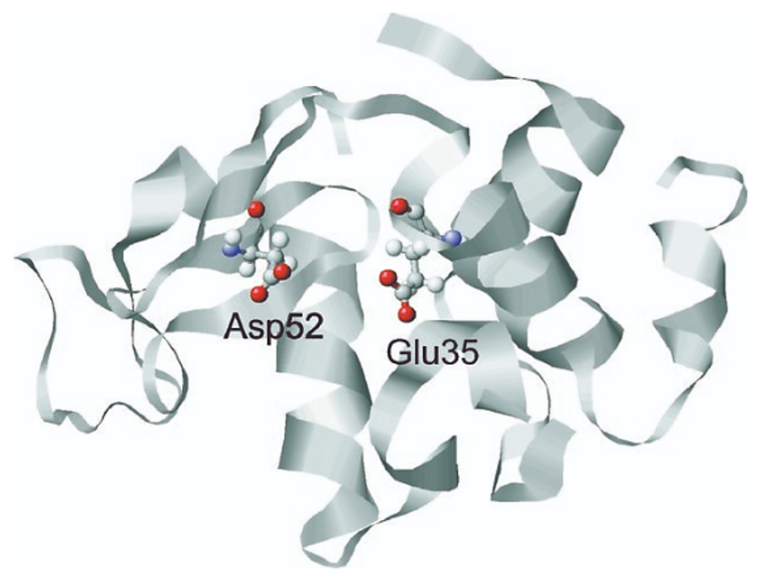
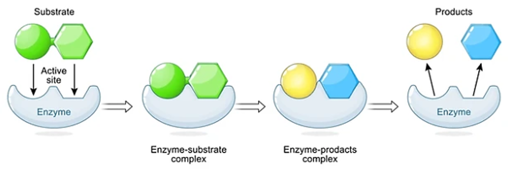
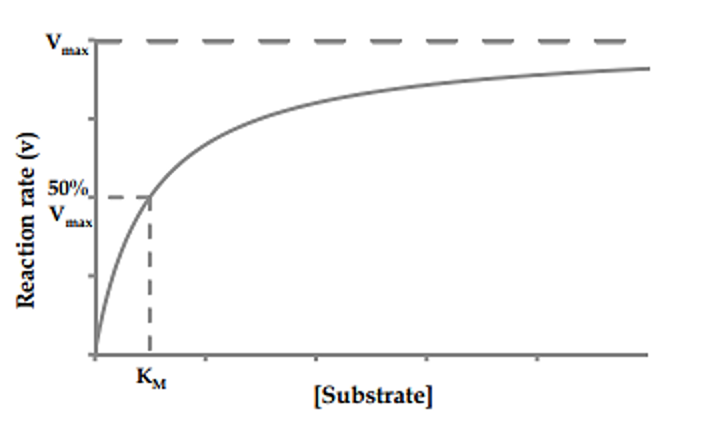

## Theory

## Lysozyme Enzyme Kinetics

**Introduction to Enzymes**
Enzymes are biological catalysts that accelerate biochemical reactions without being consumed in the process. They play a vital role in almost every cellular activity, including metabolism, DNA replication, and protein synthesis. Each enzyme acts on a specific substrate, converting it into one or more products through a highly regulated mechanism.

**Lysozyme: Structure and Function**
Lysozyme is a small, globular enzyme found in various secretions such as tears, saliva, and mucus, as well as in egg white. Its main function is to hydrolyze the polysaccharide chains in bacterial cell walls, particularly targeting the β(1→4) glycosidic bonds between N-acetylmuramic acid (NAM) and N-acetylglucosamine (NAG) in peptidoglycan. This leads to cell wall rupture and bacterial lysis. Because of this antibacterial property, lysozyme serves as a model enzyme for studying enzyme kinetics and mechanisms.

Figure adapted from Jeanette Held and Sander van Smaalen 2014, Acta Crystallographica Section D: Structural Biology 70(Pt 4):1136-1146, DOI: 10.1107/S1399004714001928

**Enzyme-Substrate Interaction**
The interaction between an enzyme and its substrate follows the Lock-and-Key or Induced Fit model.
1. Lock-and-Key Model: The enzyme's active site has a specific shape complementary to the substrate.
2. Induced Fit Model: The enzyme undergoes a conformational change upon substrate binding, optimizing the fit and facilitating catalysis.
The general reaction can be represented as: E+S&harr;ES&rarr;E+P

where E = enzyme, S = substrate, ES = enzyme-substrate complex, and P = product.

The study of enzyme kinetics helps characterize lysozyme's catalytic properties. Two fundamental parameters are determined:

- Km (Michaelis constant): Represents the substrate concentration at which the reaction rate is half of Vmax. It indicates the enzyme's affinity for the substrate.
- Vmax (Maximum velocity): The highest reaction rate when the enzyme is fully saturated with substrate.

## Michaelis-Menten Kinetics
Enzyme kinetics studies how the rate of an enzymatic reaction depends on substrate concentration, enzyme concentration, temperature, and pH.The relationship between reaction velocity (Vo) and substrate concentration ([S]) is described by the Michaelis-Menten equation:

Vo = (Vmax * [S]) / (Km + [S])

Where:

- Vo = Initial reaction velocity
- Vmax = Maximum velocity
- Km = Michaelis constant (substrate concentration at Vo=Vmax/2)
- [S] = Substrate concentration

Studying lysozyme kinetics helps students understand the fundamental principles of enzyme action, quantify catalytic efficiency, and appreciate how physiological conditions influence biological catalysis.  

A low Km indicates high substrate affinity, while a high Km suggests weaker binding.

The Michaelis-Menten curve (plot of Vo vs. [S]) is hyperbolic and plateaus at Vmax, where all enzyme active sites are occupied.

Walsh, Ryan. "Alternative perspectives of enzyme kinetic modeling." Medicinal chemistry and drug design. InTech (2012): 357-372.

## Graphical Determination of Km and Vmax
To determine Km and Vmax, experimental data is plotted using different methods:

1. **Michaelis-Menten Plot:**
- Direct plot of Vo vs. substrate concentration.
- Vmax is the plateau, and Km is the substrate concentration at half Vmax.

2. **Lineweaver-Burk Plot:**
- A linear transformation of the Michaelis-Menten equation: 1/Vo = (Km/Vmax)(1/[S]) + 1/Vmax
- Slope =Km/Vmax, Y-intercept = 1/Vmax, X-intercept = 1/Km.

## Factors Affecting Lysozyme Activity
1. **Substrate Concentration:**
- At low [S], the reaction follows first-order kinetics (rate depends on substrate).
- At high [S], the enzyme is saturated, and the reaction reaches Vmax (zero-order kinetics).

2. **Enzyme Concentration:**
- Reaction rate increases with enzyme concentration only if substrate is available in excess.

3. **pH and Temperature:**
- Lysozyme has an optimal activity at pH (~6.2) and temperature (~37&deg;C). 
- Deviations from optimal conditions can lead to reduced enzymatic activity.
- Extreme pH levels can alter the enzyme's active site conformation, affecting substrate binding and catalytic efficiency.
- High temperatures may cause enzyme denaturation, leading to structural unfolding and loss of function.
- Low temperatures can slow down molecular movement, reducing enzyme-substrate interactions and reaction rates.

Maintaining optimal pH and temperature conditions is essential for ensuring maximum lysozyme activity and stability.

**Inhibitors:**
Enzyme inhibitors regulate lysozyme activity by interfering with substrate binding or enzyme function. The two main types of reversible inhibitors are:
1. **Competitive Inhibitors:**
- Mechanism: Bind to the enzyme's active site, competing with the substrate for access.
- Effect on Kinetics: Increase Km, reducing substrate affinity. Do not affect Vmax since inhibition can be overcome by increasing substrate concentration.
- Examples: N-acetylglucosamine (NAG): A structural analog of peptidoglycan, lysozyme's natural substrate. Tetra-N-acetyl chitotetraose: A substrate mimic that competes with bacterial cell wall components.
2. **Non-Competitive Inhibitors:**
- Mechanism: Bind to an allosteric site, altering enzyme conformation and reducing catalytic efficiency.
- Effect on Kinetics: Decrease Vmax, lowering the maximum reaction rate. Do not affect Km since substrate binding remains unchanged.
- Examples: Heavy metal ions (e.g., Hg2+, Ag+, Cu2+): Disrupt lysozyme structure by binding to thiol (-SH) groups. Iodoacetamide: Modifies cysteine residues, interfering with enzymatic function.

Understanding inhibition kinetics is crucial for designing lysozyme-targeted drugs and optimizing its industrial or therapeutic applications.
  
## Conclusion
Determining Km and Vmax provides insights into lysozyme's substrate affinity and catalytic efficiency. These kinetic parameters help in enzyme comparison, inhibition studies, and industrial applications such as food preservation and pharmaceuticals. Understanding lysozyme kinetics is crucial for optimizing its use in biotechnology and medical research.

